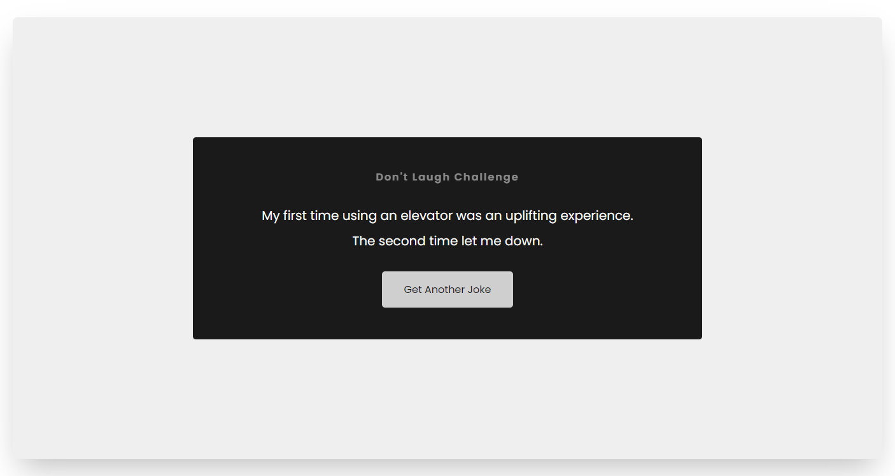

  
  
  
  
  
 
  <h2 align="center">Don't Laugh Challenge</h2>
  It generates a random joke from icanhaz API using async await fetch function.

  <a href="https://mde3.github.io/Dont-Laugh-Challenge/"><strong>➥ Live Demo</strong></a>
  

  

